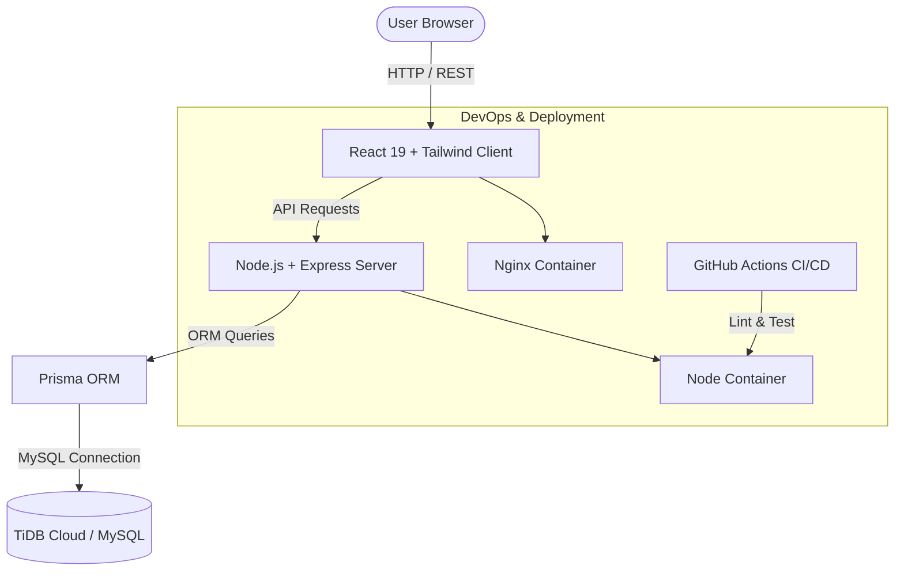

# 🏢 Dayflow HRMS — Next-Gen Enterprise Human Resource Management


**Dayflow HRMS** is an enterprise-grade, full-stack Human Resource Management System built for modern distributed teams. It streamlines employee onboarding, real-time attendance monitoring, leave approvals, and payroll analytics through a sleek, high-density dashboard UI.

---

## 🔑 Demo Access Credentials

| Role | Email | Password | Access Capabilities |
| :--- | :--- | :--- | :--- |
| **Admin** | `admin@dayflow.com` | `password123` | Full system access, company settings, employee management |
| **HR Manager** | `hr@dayflow.com` | `password123` | Attendance monitoring, leave approvals, payroll analytics |
| **Employee 1** | `john.doe@dayflow.com` | `password123` | Personal portal, clock-in/out, leave requests, payslip view |
| **Employee 2** | `jane.smith@dayflow.com` | `password123` | Personal portal, clock-in/out, leave requests, payslip view |

---

## 🏗️ System Architecture



---

## ⚡ Quickstart Guide

### Option A: 🐳 Launch with Docker Compose (Recommended)

Run the entire application stack (**MySQL 8.0 + Express Backend + Nginx React Frontend**) with one command:

```bash
# Clone and navigate into project directory
cd Dayflow

# Spin up containers
docker compose up --build
```
- **Frontend App**: [http://localhost](http://localhost) (or `http://localhost:80`)
- **Backend API**: [http://localhost:5000/api](http://localhost:5000/api)
- **Database**: `localhost:3306`

---

### Option B: 💻 Local Development Setup (Single Command)

#### Prerequisites
* Node.js v20+
* npm v10+

#### 1. Clone & Install Dependencies
```bash
git clone https://github.com/rithishcodespace/Dayflow.git
cd Dayflow

# Install monorepo dependencies (includes concurrently)
npm install
```

#### 2. Configure Environment Variables
Copy `.env.example` to `.env` in `server/`:
```bash
cp server/.env.example server/.env
```

#### 3. Database Seeding & Migrations
Sync database schema and populate demo users, attendance logs, and payroll records:
```bash
# Seed demo data into TiDB Cloud / local MySQL
npm run seed
```

#### 4. Run Both Client & Server
Start both frontend (`http://localhost:5173`) and backend (`http://localhost:5000`) concurrently:
```bash
npm run dev
```

---

## 🧪 Testing & CI/CD

### Run Integration Tests
```bash
npm test
```

### Run Frontend Linting
```bash
npm run lint --prefix client
```

### GitHub Actions CI
On every push or pull request to `main`, GitHub Actions automatically:
- Runs ESLint & production build check on `client`.
- Generates Prisma Client, executes Jest integration tests, and compiles TypeScript on `server`.

---

## 📡 API Endpoints Overview

| Method | Endpoint | Description | Auth Required |
| :--- | :--- | :--- | :---: |
| `GET` | `/api/health` | Healthcheck & DB status endpoint | ❌ |
| `POST` | `/api/auth/register-company` | Register new organization & admin | ❌ |
| `POST` | `/api/auth/login` | User authentication & JWT issuance | ❌ |
| `POST` | `/api/auth/logout` | Revoke session & clear cookies | 🔑 |
| `POST` | `/api/auth/create-employee` | Admin/HR employee creation | 🔑 (Admin/HR) |

---

## 📄 License
This project is licensed under the [ISC License](LICENSE).
